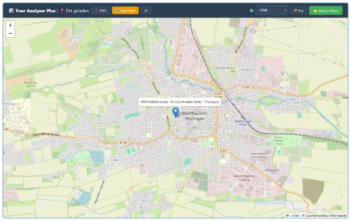
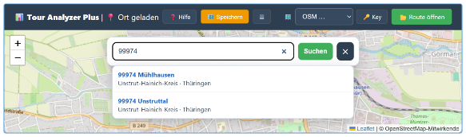
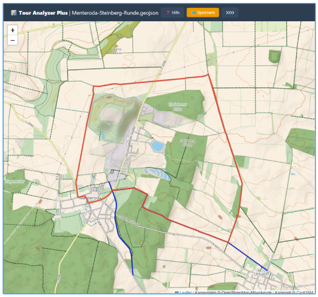
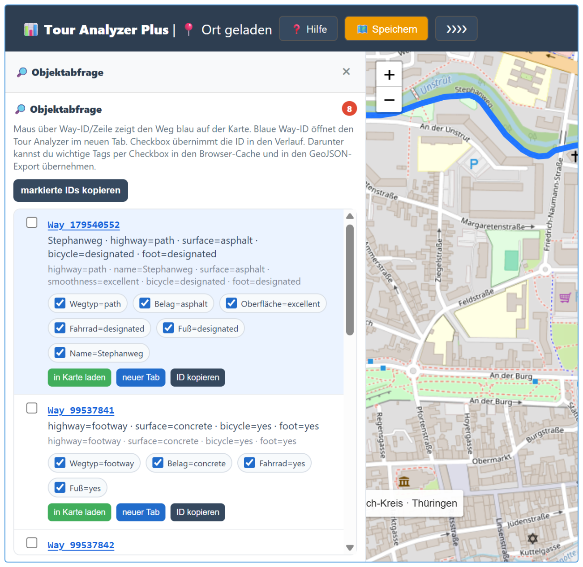
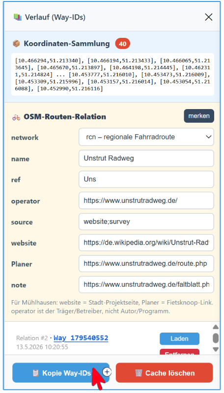
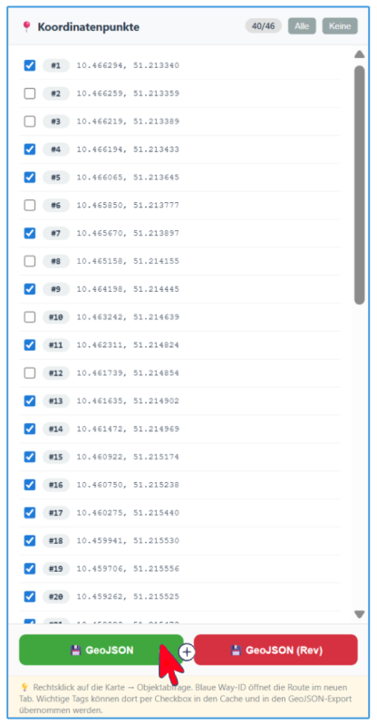
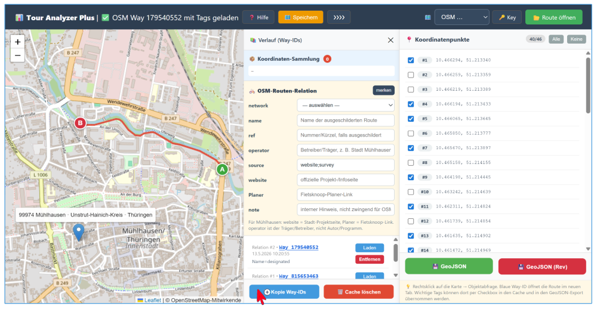

# Tour Analyzer Plus

**Tour Analyzer Plus** ist ein webbasiertes Werkzeug zur Analyse von Touren, Routen und OpenStreetMap-nahen Objektdaten.

Die Anwendung hilft dabei,

- einen Ort oder eine Route auf der Karte zu laden,
- OSM-Objekte entlang einer Strecke zu finden,
- Way-IDs und Relationstags zu prüfen,
- Koordinatenpunkte gezielt auszuwählen,
- Daten als **GeoJSON** oder **GeoJSON (Rev)** zu exportieren.

Die folgende Dokumentation zeigt nicht nur Text, sondern direkt die wichtigsten Ansichten aus der Anwendung.

---

## Wofür ist das Tool gedacht?

Tour Analyzer Plus ist vor allem dann nützlich, wenn du mit Routen, Wegen, Way-IDs und OSM-Daten arbeitest und die Ergebnisse **auf einer Karte prüfen** möchtest.

Typische Einsatzfälle:

- Ort suchen und auf die Karte springen
- Tour oder Strecke auf der Karte laden
- Objektabfrage entlang eines Bereichs oder einer Strecke durchführen
- OSM-Tags und Relationsinformationen kontrollieren
- Koordinatenpunkte gezielt auswählen
- ausgewählte Daten als GeoJSON exportieren

---

## So sieht die Anwendung aus

### 1. Startbildschirm

Nach dem Öffnen kann zunächst ein Ort geladen oder eine weitere Abfrage gestartet werden.



---

### 2. Ortsbestimmung

Über die Suche kann ein Ort ausgewählt werden. Die Anwendung springt anschließend zur passenden Position auf der Karte.



---

### 3. Tour oder GeoJSON auf der Karte anzeigen

Hier ist eine geladene Strecke beziehungsweise ein Gebiet auf der Karte sichtbar. So lässt sich schnell prüfen, ob die Daten korrekt geladen wurden.

Beispiel: **Steinberg-Runde Menteroda** in der CyclOSM-Karte.



---

### 4. Objektabfrage

Mit der Objektabfrage lassen sich OSM-Objekte und Ways im gewählten Bereich oder entlang einer Route anzeigen.

Dabei sieht man unter anderem:

- gefundene Way-IDs
- wichtige OSM-Tags
- Auswahlmöglichkeiten per Checkbox
- Schaltflächen zum Laden in die Karte, Öffnen in einem neuen Tab oder Kopieren der ID



---

### 5. OSM-Relationsinformationen und Tags

Im Verlaufs- beziehungsweise Relationsfenster können zusätzliche Informationen zu einer OSM-Routen-Relation gepflegt oder kontrolliert werden.

Dazu gehören beispielsweise:

- `network`
- `name`
- `ref`
- `operator`
- `source`
- `website`
- `Planer`
- `note`

Außerdem lassen sich Way-IDs kopieren oder zwischengespeicherte Daten löschen.



---

### 6. Koordinatenpunkte auswählen

Koordinatenpunkte können einzeln ausgewählt oder abgewählt werden. Unten stehen direkt die Export-Schaltflächen für **GeoJSON** und **GeoJSON (Rev)** zur Verfügung.

Diese Ansicht ist wichtig, wenn nicht alle Punkte übernommen werden sollen.



---

### 7. Kombinierte Arbeitsansicht

In der vollständigen Arbeitsansicht kommen mehrere Bereiche zusammen:

- Karte
- Verlaufsfenster mit Way-IDs
- OSM-Relationsdaten
- Koordinatenpunkte
- Export-Schaltflächen

Damit sieht der Benutzer auf einen Blick, wie die Anwendung im praktischen Einsatz arbeitet.



---

## Typischer Ablauf

```txt
1. Anwendung öffnen
2. Ort suchen oder Daten laden
3. Route / Strecke auf der Karte prüfen
4. Objektabfrage durchführen
5. OSM-Tags, Relationsdaten und Way-IDs kontrollieren
6. Koordinatenpunkte auswählen
7. GeoJSON oder GeoJSON (Rev) exportieren
```

---

## Was das Programm nicht macht

Tour Analyzer Plus ist **kein direkter OpenStreetMap-Editor**.

Das bedeutet:

- keine direkten Uploads nach OpenStreetMap
- keine automatische Qualitätsfreigabe für OSM-Daten
- kein Ersatz für die manuelle Prüfung in JOSM

Wenn Daten später in OSM eingetragen oder geprüft werden sollen, geschieht das separat mit geeigneten Werkzeugen.

---

## Dateien in diesem Paket

Diese ZIP enthält nur **Tour Analyzer Plus** inklusive Dokumentation und Screenshots:

```txt
index.html
hilfe.html
tour-analyzer-plus.png
proxy.php
README.md
LICENSE.md
LICENSE-CONTENT-CC-BY-SA-4.0.md
NOTICE-OSM.md
docs/screenshots/01-startbildschirm.png
docs/screenshots/02-ortsbestimmung.png
docs/screenshots/03-tour-auf-karte.png
docs/screenshots/04-objektabfrage.png
docs/screenshots/05-osm-relationsinfos.png
docs/screenshots/06-koordinatenpunkte.png
docs/screenshots/07-arbeitsansicht.png
docs/screenshots/README.md
```

---

## Installation auf dem Webspace

Kopiere alle Dateien in einen Ordner auf deinem Webspace, zum Beispiel:

```txt
/tour-analyzer-plus/
```

Danach ist die Anwendung typischerweise hier erreichbar:

```txt
https://overpass-osm.de.cool/tour-analyzer-plus/index.html
```

Die Hilfeseite liegt in:

```txt
hilfe.html
```

---

## Hinweis zu `proxy.php`

Die Datei `proxy.php` wird für Serverabfragen genutzt, wenn bestimmte Daten nicht direkt aus dem Browser geladen werden können, zum Beispiel wegen CORS oder anderer Beschränkungen.

Wenn keine Serverabfrage notwendig ist, arbeitet ein großer Teil der Anwendung direkt im Browser.

---

## Datenschutz

Lokal geladene Dateien werden grundsätzlich im Browser verarbeitet.

Wenn `proxy.php` verwendet wird, laufen die betreffenden Abfragen über den eigenen Webspace. Für Datenschutz, Serverkonfiguration und Logdateien ist der Betreiber des Webspaces verantwortlich.

---

## OpenStreetMap-Hinweis

Dieses Projekt verwendet oder verarbeitet Daten aus OpenStreetMap.

Erforderliche Namensnennung:

```txt
© OpenStreetMap-Mitwirkende
```

Die OSM-Daten stehen unter der **Open Database License (ODbL) 1.0**.

Weitere Hinweise stehen in:

```txt
NOTICE-OSM.md
```

---

## Lizenz

Der Programmcode steht unter der **MIT License**.

Siehe:

```txt
LICENSE.md
```

Dokumentation, Screenshots und erklärende Inhalte stehen zusätzlich unter **CC BY-SA 4.0**, sofern nichts anderes angegeben ist.

Siehe:

```txt
LICENSE-CONTENT-CC-BY-SA-4.0.md
```

---

## Projektstand

```txt
Anwendung: Tour Analyzer Plus v1.6.5
Webspace-Paket: v1.6.5
```

## Autor

```txt
Lutz Müller
```
